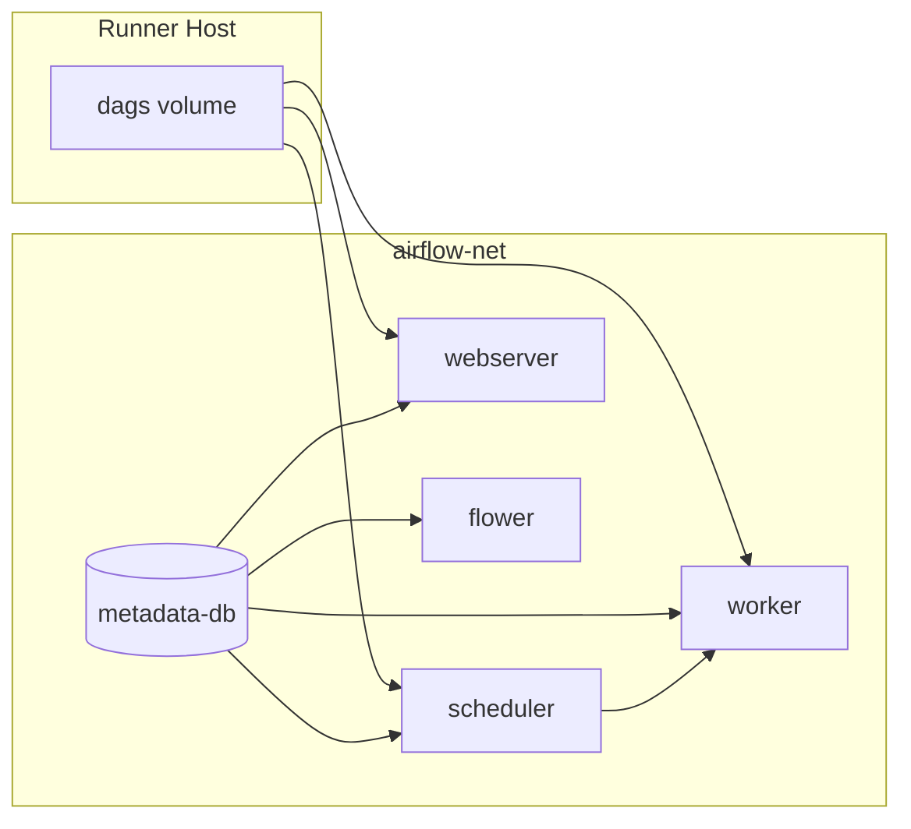
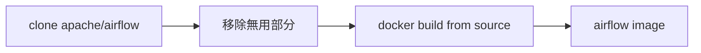

# Airflow 方案 A：從源碼建置、分離元件 Docker 化與 GitLab CI 計劃書

## 目標與約束

- **建置**：**僅採用方案 A（Customizing）**。本方案 A 建置流程為 **自 [https://github.com/apache/airflow](https://github.com/apache/airflow) 下載源碼，移除與建置無關之部分後，以該 source 搭配 repo 內 Dockerfile 自建 image**；僅下載 Dockerfile 從 PyPI 建置為可選簡化方式（見 2.2）。
- **元件分離**：對應圖中 8 項，以「多個容器 + 掛載」方式實現，**不使用 docker-compose**。
- **CI/CD**：GitLab CI 在 **shell executor** 上執行，**不使用 Container Registry**（本機 build、本機 run、本機清理）。

---

## 一、元件對應與架構

圖中項目與實際實作對應如下：

| 圖中項目                    | 實作方式          | 說明                                                  |
| ----------------------- | ------------- | --------------------------------------------------- |
| **airflow-metadata-db** | 獨立容器          | PostgreSQL（或 MySQL）官方映像，存 DAG run、task 狀態等。         |
| **airflow-scheduler**   | 同一 Airflow 映像 | `docker run ... airflow scheduler`。                 |
| **airflow-webserver**   | 同一 Airflow 映像 | `docker run ... airflow webserver`。                 |
| **airflow-worker**      | 同一 Airflow 映像 | 使用 Celery 時：`docker run ... airflow celery worker`。 |
| **airflow-flower**      | 同一 Airflow 映像 | 使用 Celery 時：`docker run ... flower`。                |
| **airflow-executor**    | 設定項           | 非容器，由 `AIRFLOW__CORE__EXECUTOR` 與連線字串等環境變數決定。       |
| **airflow-dags**        | 掛載目錄          | 主機或 CI 的 `./dags` 掛載到容器 `/opt/airflow/dags`。        |
| **airflow-readme**      | 文件            | 專案內 README，不需容器。                                    |

若採用 **LocalExecutor**（單機、無 Celery），則只需：metadata-db + scheduler + webserver + dags 掛載；worker / flower 可省略或於計劃中標註為「可選」。



### 1.2 開發與部署環境（Mac / Rocky Linux）

- **開發**：在 Mac 上編輯 Dockerfile、scripts、dags、.gitlab-ci.yml 皆可，與 OS 無關；路徑使用 `$(pwd)/dags` 或 `$CI_PROJECT_DIR/dags` 在 Mac 與 Rocky 均適用。
- **部署 / CI**：建議 GitLab Runner 使用 **Rocky Linux**、**shell executor**；在 Rocky 上執行 `scripts/build.sh` 與 `scripts/start-airflow.sh`，建出並運行的為 **linux/amd64** 映像，無架構問題。
- **映像平台**：
  - Mac Intel：Docker 多為 linux/amd64，本機建出的映像可與 Rocky 一致。
  - Mac Apple Silicon (M1/M2/M3)：預設為 linux/arm64，**不可**直接拿到 Rocky (amd64) 跑。
  - 若要在 **Mac 上建出給 Rocky 用的映像**：建置時加 `--platform linux/amd64`（例如在 2.2 一鍵建置指令或 `scripts/build.sh` 中），產出即可在 Rocky 使用（Apple Silicon 上會經 QEMU 模擬，建置較慢）。
- **建議用法**：日常在 Mac 開發與 commit；**正式建置與測試由 Rocky Linux 上的 CI 執行**，映像在 Rocky 本機 build、本機 run，無需 `--platform`。

---

## 二、方案 A 建置流程（方便 BUILD 的執行順序）

本計劃**僅採用方案 A（Customizing）**。主流程為：**自 https://github.com/apache/airflow 下載源碼 → 移除無用部分 → 以該 source 搭配 repo 內 Dockerfile 自建 image**。以下為可直接依序執行的建置步驟。

### 2.0 下載源代碼

- **主流程（從 GitHub 源碼建置）**：來源為 **https://github.com/apache/airflow**。以 `git clone` 下載指定版本或 tag，例如：
  ```bash
  git clone --depth 1 --branch <tag或branch> https://github.com/apache/airflow.git <目錄名>
  ```
  可指定 `--branch 3.2.0` 或 `--branch main`。下載後依 2.3 進行「移除無用部分」與 `docker build`；建置完成後可刪除 clone 目錄以釋放空間。
- **可選簡化方式（A1：僅下載 Dockerfile、從 PyPI 建置）**：不需 clone 完整源碼。以 `curl` 取得對應版本之 Dockerfile 存於 `docker/Dockerfile.airflow`，從 PyPI 安裝指定版本（見 2.2）。

**快速 BUILD 摘要（可選 A1，不需 clone）**  
在專案根目錄建立 `docker/` 後，下載 Dockerfile 到 `docker/Dockerfile.airflow`，再執行：

```bash
export DOCKER_BUILDKIT=1
docker build -f docker/Dockerfile.airflow --build-arg AIRFLOW_VERSION=3.2.0 -t airflow:3.2.0-custom .
```

若在 **Apple Silicon Mac** 上建置且映像要在 **Rocky Linux** 使用，請加 `--platform linux/amd64`。詳見下方 2.2／2.3。

### 2.1 建置前檢查

| 項目       | 要求                                                         | 檢查方式                                       |
| -------- | ---------------------------------------------------------- | ------------------------------------------ |
| Docker   | 23.0.0+                                                    | `docker --version`                         |
| BuildKit | 啟用                                                         | `export DOCKER_BUILDKIT=1`                 |
| 工作目錄     | 專案根目錄 AirFlow/                                             | `pwd` 應為含 `docker/`、`scripts/` 的目錄         |
| **目標平台** | 若映像要在 Rocky Linux 跑，建置應在 Rocky 或加 `--platform linux/amd64` | 本機：`docker buildx ls`；CI 建議在 Rocky 上 build |

### 2.2 BUILD 步驟（可選 A1：僅下載 Dockerfile、從 PyPI 指定版本建置）

1. **建立目錄、下載源代碼（官方 Dockerfile）**
   - 在專案根目錄建立：`docker/`、`docker/context/`、`scripts/`、`dags/`、`config/`。
   - 下載建置所需之 Dockerfile（即 A1 之「源代碼」）並存為 `docker/Dockerfile.airflow`：
     ```bash
     curl -o docker/Dockerfile.airflow "https://raw.githubusercontent.com/apache/airflow/3.2.0/Dockerfile"
     ```
   - 若要用 main 最新：將 URL 改為 `https://raw.githubusercontent.com/apache/airflow/main/Dockerfile`。
2. **一鍵建置指令（本機試建）**
   - 在專案根目錄執行（請先 `export DOCKER_BUILDKIT=1`）：
     ```bash
     docker build -f docker/Dockerfile.airflow \
       --build-arg AIRFLOW_VERSION=3.2.0 \
       --build-arg AIRFLOW_PYTHON_VERSION=3.12.12 \
       -t airflow:3.2.0-custom \
       .
     ```
   - 本機（Mac Intel 或僅在 Mac 跑）：維持上列指令即可。**Mac 建給 Rocky 用**：在 `docker build` 中加上 `--platform linux/amd64`（若開發機為 Apple Silicon 且需產出給 Rocky 的映像，務必加上）。
   - 建置完成後驗證：`docker run --rm airflow:3.2.0-custom airflow version`。
3. **可選：自訂依賴**
   - 在 `docker/context/requirements.txt` 加入額外套件，建置時加上：
     `--build-arg DOCKER_CONTEXT_FILES=docker/context`
     （官方 Dockerfile 需支援該 arg；若無，可於 Dockerfile 內 COPY context 並 pip install。）

### 2.3 BUILD 步驟（主流程：從 GitHub 下載源碼 → 移除無用部分 → 用 repo 內 Dockerfile 從 source 建 image）

流程：**自 https://github.com/apache/airflow 下載源碼 → 移除無用部分（見 2.4）→ 以該 source 搭配 repo 內 Dockerfile 自建 image**。



1. **下載源代碼：Clone Airflow 並進入 repo 根目錄**
   ```bash
   git clone --depth 1 --branch 3.2.0 https://github.com/apache/airflow.git airflow-src
   cd airflow-src
   ```
   可改為 `--branch main` 或其他 tag。
2. **（可選）移除無用部分**：縮小 build context、加快建置。可僅依賴 repo 內 **`.dockerignore`**（[apache/airflow 已有 .dockerignore](https://github.com/apache/airflow/blob/main/.dockerignore)），`docker build` 會自動排除其中所列檔案；或於 build 前以腳本刪除 2.4 表格所列目錄（如 `.github/`、`docs/`、各類 `*-tests/` 等），需確認 Dockerfile 或內建 script 未引用該路徑。
3. **啟用 BuildKit 並以 repo 內 Dockerfile 從 source 建置**
   ```bash
   export DOCKER_BUILDKIT=1
   docker build -f Dockerfile \
     --build-arg AIRFLOW_INSTALLATION_METHOD=. \
     --build-arg AIRFLOW_SOURCES_FROM=. \
     --build-arg AIRFLOW_SOURCES_TO=/opt/airflow \
     --build-arg AIRFLOW_VERSION=3.2.0 \
     -t airflow:3.2.0-from-source \
     .
   ```
4. **驗證**：`docker run --rm airflow:3.2.0-from-source airflow version`。
5. **可選：移除下載之源碼**：建置完成且驗證通過後，可刪除 clone 目錄以釋放空間，例如回到上層目錄執行 `rm -rf airflow-src`。CI 中建議於 `after_script` 或 job 結束前清理。

### 2.4 移除無用檔案（縮小 build context、保持專案簡潔）

**從 GitHub clone 後的移除無用部分**

- Apache Airflow 倉庫內已有 **`.dockerignore`**（[apache/airflow .dockerignore](https://github.com/apache/airflow/blob/main/.dockerignore)），clone 後建置時 `docker build` 會自動排除其中所列檔案，無須手動刪除即可縮小 context。
- **可選**：若需進一步縮小，在 clone 後、`docker build` 前，用腳本刪除下表所列目錄。若 Dockerfile 或內建 script 會 COPY/參考某路徑，則不可刪除；建議先以「不刪、僅用 .dockerignore」建一次，再逐步刪除並驗證。

| 類型 | 目錄／檔案 | 說明 |
|------|------------|------|
| CI / 開發 | `.github/` | GitHub Actions，建 image 不需 |
| 文件 | `docs/`、`contributing-docs/`、`RELEASE_NOTES.rst`、`BREEZE.rst`、`CONTRIBUTING.rst` 等 | 建 image 不需 |
| 測試 | `airflow-ctl-tests/`、`airflow-e2e-tests/`、`docker-tests/`、`helm-tests/`、`kubernetes-tests/`、`task-sdk-integration-tests/` | 建 production image 不需 |
| 開發工具 | `.devcontainer/`、`.pre-commit-config.yaml`、`.editorconfig`、`.gitpod.yml`、`performance/` | 建 image 不需 |
| 其他 | `chart/`（Helm）、`manifests/`、`clients/`、`go-sdk/`、`task-sdk/`、`generated/` 等 | 依 Dockerfile 是否引用決定；多數 production 建置不需 |

**本專案（AirFlow 目錄）**

- **Build context**：在專案根目錄新增 **`.dockerignore`**，排除不需送入 `docker build` 的檔案與目錄（例如 `.git/`、`.cursor/`、`*.md`、`docs/`、`*.log`、`.env`、`__pycache__/`）。若在專案外 clone airflow（如 `airflow-src/`），該目錄為獨立 build context，無須寫入本專案 .dockerignore。
- **專案目錄**：僅保留建置與執行所需之檔案；無用的臨時檔、舊版 Dockerfile 備份等應自 repo 移除或列入 `.gitignore`。
- **建置後**：自 GitHub clone 的 Airflow 源碼目錄，建置完成後可刪除（如 `rm -rf airflow-src`），避免佔用磁碟。

### 2.5 方案 A 關鍵 build-arg 速查

| build-arg                   | A1（PyPI）            | A2（源碼）              |
| --------------------------- | ------------------- | ------------------- |
| AIRFLOW_VERSION             | 必填，如 `3.2.0`        | 建議填，與 branch/tag 一致 |
| AIRFLOW_SOURCES_FROM        | 預設 `Dockerfile`     | `.`                 |
| AIRFLOW_SOURCES_TO          | 預設 `/Dockerfile`    | `/opt/airflow`      |
| AIRFLOW_INSTALLATION_METHOD | 預設 `apache-airflow` | `.`                 |
| AIRFLOW_PYTHON_VERSION      | 可選，如 `3.12.12`      | 可選                  |

---

## 三、專案目錄結構建議（方案 A，方便 BUILD）

```
AirFlow/
├── .dockerignore             # 排除無用檔案，縮小 build context（見 2.4）
├── .gitlab-ci.yml
├── README.md
├── docker/
│   ├── Dockerfile.airflow      # 官方 Dockerfile（2.2 步驟下載）
│   └── context/
│       └── requirements.txt   # 可選，自訂 PyPI 依賴
├── scripts/
│   ├── build.sh               # 封裝上述 docker build 指令，供 CI/本機使用
│   ├── start-airflow.sh
│   └── stop-airflow.sh
├── dags/
│   └── .gitkeep
├── config/
│   └── env.example
└── docs/
    └── IMPLEMENTATION_PLAN.md
```

- **airflow-executor**：在 `scripts/start-airflow.sh` 或 `config/env.example` 中以環境變數設定（如 `AIRFLOW__CORE__EXECUTOR=LocalExecutor`）。

---

## 四、Shell 腳本取代 docker-compose 的設計要點

- **網路**：建立專用 bridge，例如 `docker network create airflow-net`，所有服務用 `--network airflow-net`。
- **啟動順序**：  
  1. 建立 network。  
  2. 啟動 **airflow-metadata-db**（PostgreSQL），暴露埠（如 5432）。  
  3. 等待 DB 就緒（例如 `until docker exec airflow-db pg_isready -U postgres; do sleep 2; done`）。  
  4. 依序或並行啟動 **scheduler**、**webserver**；若為 Celery，再啟動 **worker**、**flower**。  
- **共用設定**：  
  - 所有 Airflow 容器使用相同 `AIRFLOW__DATABASE__SQL_ALCHEMY_CONN`（指向 metadata-db 容器名與埠）。  
  - `AIRFLOW__CORE__EXECUTOR`、`AIRFLOW__CELERY__*` 等由環境變數或 `config/env.example` 提供。  
- **DAG 掛載**：每個 Airflow 容器加上 `-v $(pwd)/dags:/opt/airflow/dags`（或 CI 中 `$CI_PROJECT_DIR/dags`）。  
- **清理**：`stop-airflow.sh` 中對上述容器做 `docker stop` / `docker rm`，最後 `docker network rm airflow-net`。

這樣即可在不使用 docker-compose 的前提下，對應圖中除「airflow-executor」「airflow-readme」外的所有元件。

---

## 五、GitLab CI 設計（shell executor、無 Registry）

- **Runner**：僅使用 **shell executor**，且該 Runner 主機需已安裝 Docker，執行 Runner 的使用者具備 `docker` 權限（例如在 `docker` group）。**Runner 建議**：Runner 主機建議為 **Rocky Linux**（或同為 linux/amd64），在此執行 `scripts/build.sh` 產出的映像即為 amd64，與部署環境一致，無需指定 `--platform`。
- **不推送到 Registry**：CI 中僅 `docker build` 與 `docker run`，不執行 `docker push`。
- **單一 Runner 一致性**：為避免 image 只存在某台機器，CI 的 build 與 run 應在同一台 shell runner 上執行（透過 `tags` 指定同一組 tag）。

建議的 `.gitlab-ci.yml` 結構（概念）：

- **Stage 1：build（方案 A）**  
  - 僅在 shell runner 上執行（`tags: [shell]`）。  
  - 執行 `scripts/build.sh`：內容即 2.2 的建置指令，tag 使用 `airflow:${CI_COMMIT_SHA}` 或 `airflow:${AIRFLOW_VERSION}-custom`。  
  - 若採主流程（從 GitHub 源碼建置）：在 build.sh 內 clone https://github.com/apache/airflow，可選移除無用部分（見 2.4），於 repo 根目錄執行 build，並傳入 `AIRFLOW_INSTALLATION_METHOD=.`、`AIRFLOW_SOURCES_FROM=.`、`AIRFLOW_SOURCES_TO=/opt/airflow`。
- **Stage 2：integration**（或合併到同一 job）  
  - 執行 `scripts/start-airflow.sh`（使用剛建好的 `airflow:${CI_COMMIT_SHA}`）。  
  - 等待 webserver 健康（例如 `curl -f http://localhost:8080/health` 重試數次）。  
  - 執行簡單驗證：例如在容器內跑 `airflow dags list` 或呼叫 Airflow REST API。  
  - 在 `after_script` 或同一 job 最後執行 `scripts/stop-airflow.sh`，確保容器與 network 被移除。
- **變數**：  
  - 映像 tag 使用 `$CI_COMMIT_SHA` 或 `$CI_COMMIT_REF_SLUG`，確保每次 commit 可區分且不依賴 Registry。  
  - DB 密碼、連線字串等用 GitLab CI variables（Masked）傳入，不要寫死在腳本中。

這樣即滿足：**方案 A** 從源碼／指定版本建置、圖中元件分離成多容器、不用 docker-compose、不用 Container Registry、使用 shell executor。

---

## 六、實作檢查清單（方案 A，按 BUILD 順序）

1. **下載源代碼**：主流程自 **https://github.com/apache/airflow** clone 指定版本（如 `--branch 3.2.0` 或 `main`）至專案外目錄（見 2.0、2.3）。可選簡化方式（A1）：僅下載官方 Dockerfile 至 `docker/Dockerfile.airflow`（見 2.2）。
2. **移除無用檔案**：clone 後使用 repo 內 **`.dockerignore`**（apache/airflow 已有），可選移除 2.4 表格所列目錄以進一步縮小 context。本專案新增 `.dockerignore` 排除不需送入 build 的檔案；專案內無用檔自 repo 移除或列入 `.gitignore`。建置完成後可刪除 clone 目錄。
3. **建置用**：建立 `scripts/build.sh`，內容為 2.2 的 `docker build` 指令（含 `DOCKER_BUILDKIT=1`、`--build-arg AIRFLOW_VERSION=...`、`-t airflow:${TAG}`），方便本機與 CI 共用。
4. **執行用**：建立 `scripts/start-airflow.sh`（network → metadata-db → 等待 DB → scheduler、webserver；環境變數與 dags 掛載）。
5. **執行用**：建立 `scripts/stop-airflow.sh`（停止並刪除容器與 network）。
6. **CI 用**：撰寫 `.gitlab-ci.yml`（build → start → 健康檢查 → stop），限定 shell runner，不 push Registry。
7. **可選**：準備 `dags/.gitkeep`、`config/env.example`（含 executor 設定）。
8. **Runner 主機**：建議使用 **Rocky Linux**（或 linux/amd64）；Docker 23.0+、BuildKit 可用、同一組 shell runner 負責 build 與 run。若 Runner 為 Mac（如僅本機測試），且需產出給 Rocky 的映像，則在 `scripts/build.sh` 內為 `docker build` 加上 `--platform linux/amd64`。

---

## 七、風險與注意事項

- **Mac 與 Rocky 架構**：在 Apple Silicon Mac 上建出的映像預設為 arm64，無法在 Rocky (x86_64) 直接執行；正式建置建議在 Rocky 上執行，或在 Mac 建置時使用 `--platform linux/amd64`。
- **Shell executor 與 Docker**：job 直接跑在 Runner 主機上，建出的 image 僅存在該主機；若有多台 shell runner，需保證「建置與執行」在同一台，或接受每台各自 build。
- **從源碼建置時間**：方案 A 首次建置較久（A2 更久），可善用 `docker build` 快取與 BuildKit；可選 `DEPENDENCY_CACHE_EPOCH` 控制依賴快取。
- **Executor 選擇**：LocalExecutor 不需 Redis/Celery，腳本較簡單；CeleryExecutor 需在 `start-airflow.sh` 中多起 Redis 與 worker/flower，並設定 `AIRFLOW__CELERY__BROKER_URL` 等。
- **機密**：DB 密碼、broker URL 等一律透過 GitLab CI variables 傳入，勿寫入程式庫。

依此計劃實作即可達成：**方案 A** 從 source／指定版本建 Airflow、圖中元件分離進 Docker、無 docker-compose、GitLab CI 使用 shell executor 且不使用 Container Registry。建置時直接依 **第二章 BUILD 步驟** 執行即可。
